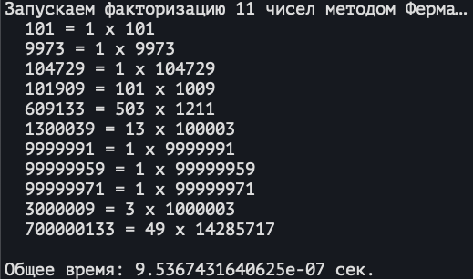

# Лабораторная работа №6: Оптимизация алгоритма факторизации методом Ферма с использованием Cython

## Задания

### Шаг 1: Оптимизация с помощью Cython

### Вывод в консоль:

### HTML-отчет:

### Шаг 2: Распределенные вычисления

### Вывод в консоль:

### График:

### Шаг 3: Работа с GIL

### Вывод в консоль:

